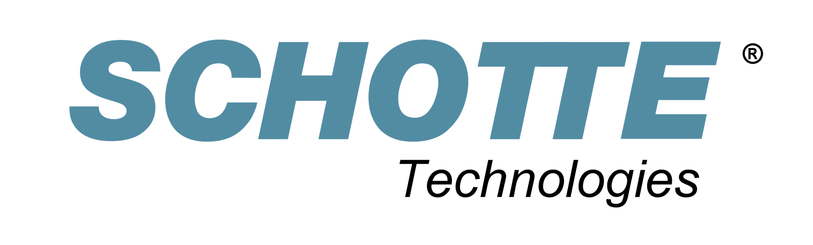

<!--  
<h3 align="center">
  <a href="https://docs.google.com/forms/d/e/1FAIpQLSegqE_srBeCVRJyyzYTrg0mcZAQsLEN1gQThHxMP2hL7_fXgQ/viewform?usp=header" style="font-size: 1.2em; font-weight: bold; background-color: #cf5c04; padding: 15px 30px; border-radius: 8px; text-decoration: none; color: white;">
    Call for Contributions
  </a>
</h3>
 

-->
## Aim of the workshop

The **5th Workshop on Intelligent and Automated Waterway Transportation**,  which will take place on September 15th, 2026 at the IEEE International Conference on Intelligent Transportation Systems in Naples, Italy, aims to foster technical and scientific exchange between academia, industry, and public authorities in the rapidly evolving fields of autonomous waterborne transportation and smart intermodal logistics. It serves as a platform to present and discuss recent advancements in intelligent and automated systems for inland, coastal and off-shore maritime transportation. Key topics include autonomous vessel development, advanced assistance systems, modeling and simulation, digital twins for waterways, navigation and control strategies, as well as automation of cargo handling. By bringing together experts from research institutions, industry leaders, consultants, and regulatory bodies, the workshop encourages interdisciplinary dialogue and collaboration. As an integral part of the broader Intelligent Transport Systems (ITS) community, the workshop emphasizes the role of autonomous shipping in shaping the future of transportation. 	 

## Workshop schedule

<table style="text-align:left;"> 

<colgroup>
  <col style="width:30%;">
  <col style="width:40%;">
  <col style="width:10%;">
  <col style="width:10%;">
</colgroup>

<tr><th>Time</th><th>Title</th><th>Speaker</th><th>Affiliation</th></tr>
<tr><th>Time</th><th>Title</th><th>Speaker</th><th>Affiliation</th></tr>
<tbody> 

<tr><td>09:30–09:35</td><td align="center" colspan="3"><em>Opening</em></td></tr> 

<tr><td>09:35–10:05</td><td>Automation of Transport Systems on Land and Waterways</td>
<td><a href="#schramm">Dr. Dieter Schramm</a></td>
<td>University of Duisburg-Essen, Germany</td></tr> 

<tr><td>10:05–10:35</td><td>Beyond Mobility: Intelligent Multimodal Transport Systems for Critical Energy Infrastructure</td>
<td><a href="#luebke">Michael Lübke</a></td>
<td>Evos, Germany</td></tr> 

<tr><td>10:35–10:45</td><td align="center" colspan="3"><em>Coffee Break</em></td></tr> 

<tr><td>10:45–11:15</td><td>Navigating Uncertainty: Safety Risk Modeling and Validation for Remote Pilotage</td>
<td><a href="#goerlandt">Dr. Floris Goerlandt</a></td>
<td>Dalhousie University, Canada</td></tr> 

<tr><td>11:15–11:45</td><td>A Data-Driven Approach to Quantify Safety and Ease of Navigation of Highly Automated Inland Waterway Vessels</td>
<td><a href="#daubner">Jannis Daubner</a></td>
<td>Federal Waterways Engineering and Research Institute, Germany</td></tr> 

<tr><td>11:45–12:00</td><td align="center" colspan="3"><em>Discussion &amp; Closing</em></td></tr> 

</tbody></table>

Please note: This schedule is tentative and subject to change.

## About the invited speakers

## Invited experts

### [Dr. Dieter Schramm](https://www.uni-due.de/mechatronik/team/schramm.php)

 Dieter is Senior Professor at the University of Duisburg-Essen. He graduated in mathematics at the University of Stuttgart in 1981, worked there from 1981-1986 as a research assistant and received his PhD in Engineering in 1986. From 1986-1998 he worked at Robert Bosch GmbH as group leader and department head of predevelopment and series development departments for automotive systems. He joined Tyco Electronics Ltd. in 1999 and held the positions of Director Global Automotive Engineering and later CEO of Tyco Electronics Pretema GmbH until 2003. In 2004 he was appointed Full Professor and head of the Chair of Mechatronics at the University of Duisburg-Essen and since 2006 elected Dean of the Faculty of Engineering. In 2015 he was awarded Dr. h.c. by the University of Miskolc, Hungary. His current research interests are electrified and highly automated automobiles and ships, vehicle dynamics and cable driven and cooperative robots. Along with his research activities he is director and partner of several companies in the field of research and post graduated education in Germany and South East Asia.

_Title of talk: Automation of transport systems on land and waterways_

### [Dr. Floris Goerlandt](https://www.dal.ca/faculty/engineering/industrial/faculty-staff/our-faculty1/associate-professors/Goerlandt.html)

 Floris is Associate Professor in Dalhousie University, Canada, where he holds the Canada Research Chair (Tier 2) in Risk Management and Resource Optimization for Marine Industries. He received a degree of Doctor of Science (Tech.) from Aalto University, Finland, and has Master of Science degrees from Ghent University and Antwerp University, Belgium. He primarily works on applied risk research, developing methods and techniques to support risk analysis, management, and governance of maritime activities. He currently works on remote pilotage, maritime Search and Rescue, and risk management in seaports. Apart from applied research, he also has a keen interest in fundamental questions in safety science, with a current focus on the validation of risk and safety analysis techniques. Dr. Goerlandt serves on the Editorial Board of the Safety Science and Risk Analysis journals, and currently leads a special issue on Risk and Resilience in Crisis and Emergency Management. He contributes to the activities of the Working Group on Waterway Risk Management of the International Association for Aids to Navigation and is board member of the Canadian Maritime Shipping Risk Forum community of practice. He strives to promote academic insights into risk analysis, management, and governance practices in maritime industrial and policy contexts.	 

_Title of talk: Navigating uncertainty: Safety risk modeling and validation for remote pilotage_

### [Michael Lübke](https://www.linkedin.com/in/michaelluebke)

 Michael is Group Operations Manager at Evos, one of Europe's largest tank storage operator managing critical energy infrastructure across major port locations. With an academic background in engineering and sociology, he combines technical system design with human-centered operational leadership. His work focuses on harmonising operating models across terminals, strengthening safety culture, and integrating intelligent digital systems into multimodal energy logistics. Tank terminals sit at the intersection of land- and waterside transport: connecting vessels, rail, trucks and pipeline systems into a single operational network. As Europe transitions toward hydrogen, ammonia, CO₂ and low-carbon fuels, this infrastructure must evolve into intelligent, semi-autonomous, and cross-border systems. Michael advocates for a systemic view of transport and energy infrastructure—thinking beyond modal silos and national boundaries—to enable safe, scalable and digitally integrated energy logistics for the next decades. 

_Title of talk: Beyond Mobility: Intelligent Multimodal Transport Systems for Critical Energy Infrastructure_

### [Jannis Daubner](https://www.linkedin.com/in/jannis-daubner-608270258)

 

_Title of talk: A data driven approach to quantify safety and ease of navigation of highly automated inland waterway vessels_

## Expected participation

Members of industry, research, consultancy and public authorities in the field of autonomous shipping, intelligent water-based logistics and related topics are the target audience of this workshop.

Please make sure to register for the ITSC Workshop Day in order to be able to participate.

## Organizers

* [Dr. Philipp Sieberg](https://www.linkedin.com/in/dr-philipp-sieberg-1a21bb199/?originalSubdomain=de), Schotte Automotive GmbH & Co. KG., Germany & University of Duisburg-Essen, Germany
* [Dr. Hanna Krasowski](https://hanna.krasowski.io/), University of California, Berkeley, CA, United States 
* [Kathrin Donandt](https://www.uni-due.de/srs/person.php?Id=147), University of Duisburg-Essen & Federal Waterways Engineering and Research Institute, Germany
* [Dr. Frédéric Etienne Kracht](https://www.linkedin.com/in/frederickracht), Development Center for Ship Technology and Transport Systems (DST), Germany
* [Dr. Lars Andreas Lien Wennersberg](https://www.sintef.no/en/all-employees/employee/lars.andreas.wennersberg/), SINTEF, Norway

 
 

  
  <!-- First Row -->
  

  

  

  <!-- Second Row -->
  

  

